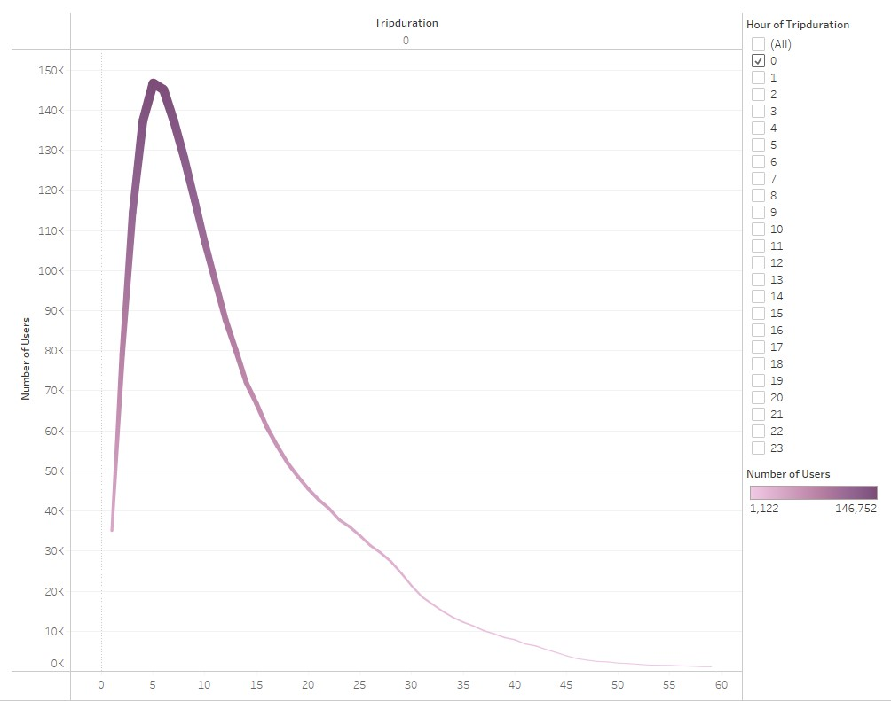
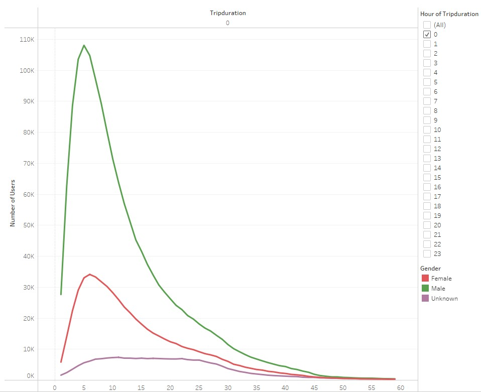

# bikesharing
 
## An analysis of NYC Citibike bike-sharing from August of 2019 using Tableau.

 

### Project overview

Bike sharing programs have risen in popularity across the United States since the mid-2000s and offer their customers the convenience of bike rental options wherever there are in their cities. Programs generally include station-based bikes and payment systems that can be utilized with memberships and passes or per-hour usage fees. Bike sharing options benefit citizens due to their low cost, often being a cheaper option to car rentals or public transportation. In areas that attract tourism, bike sharing programs are popular ways to encourage visitors to explore the city while exercising and enjoying the nature around them. Bike sharing programs offer cost efficient solutions to occasional bikers, tourists, and commuters who cannot travel with and store their personal bikes with them. 

The purpose of this project is to prepare a visual analysis of NYC CitiBike data for potential investors interested in implementing a similar bike-sharing program in Des Moines, Iowa. The data chosen for this analysis was from the month of August, a historically busy month for business with Citibike, from the year 2019 in New York City, New York. 

Tableau was used to create a presentation containing visualizations that answered some of the following questions:
•	Who uses bike-sharing programs? 
•	What areas of the city have the most and least Citibike activity?
•	When and how often are bikes used and who is using them?

With these questions answered, observations can be made and applied to the Citibike’s potential bike-sharing program in Des Moines, IA, or any other city, to ensure its implementation is successful. 

A link to the Tableau presentation is below:

[CitiBike Tableau Presentation](https://public.tableau.com/app/profile/jeanine.jordan/viz/NYCCitiBikeAnalysisChallenge_16656381502750/NYCCitiBikeAnalysis?publish=yes)

### Resources

#### Dataset:

* 201908-citibike-tripdata.csv
* 201908-citibike-tripdata.csv_updated

#### Software:

* Tableau 2022.2.1
* Python 3.7.6
* Jupyter Notebook (Version)
* Pandas library

### Results

To conduct the necessary analysis, the original dataset required a column to be converted from an integer value to an expression of time. This was accomplished by using Python, the Pandas dependencies and the text editor, Jupyter Notebook. An updated dataset was subsequently created. 

A screenshot of the code written to do this is below:
 

In the first visualization below, customer types are explored where it is observed that eighty-one percent of the customer base are monthly or yearly subscribers of the Citibike program.  The remaining nineteen percent are customers, utilizing rental bikes as needed without a subscription. 

 

In the visualization below, the beginning and ending destinations are examined to determine where the highest and lowest traffic areas for Citibike are located. Manhattan is a densely populated area of New York City for tourism as well as for bustling residential and commercial properties. The Manhattan area of NYC clearly experiences the highest rental bike traffic in comparison to the adjacent neighborhoods. The bubbles on the visualization below represent different Citibike stations and differentiate in size and color depending on their traffic.

  

In the visualization below, the peak hours of bicycle usage are explored. The times of the day with the highest level of usage can be attributed to the morning and evening weekday rush hours. Due to the low usage reports from two a.m. to five a.m., maintenance related tasks could be scheduled to be conducted during this time. 

 

In the visualization below, each individual square on the map represents an individual Citibike utilized. The colors show the level of usage each bike receives which can be used to implement a maintenance schedule for the bikes receiving the most usage.

 

In the visualization below, heatmaps display the weekly usage patterns by hour. The highest levels of usage are observed to be during weekday morning and evening commute times, as well as spread out throughout weekend afternoons. 

 

In the heatmap visualization below, utilization patterns by the hour of the day and day of week are also examined by gender. Once again, a correlation between weekday commute times and weekend afternoons is observed; however, in this depiction of the data reported it is seen that the male customers make up the bulk of the CitiBike customer base in NYC in comparison to female identifying and unknown or undisclosed users. 

 

In the heatmap visualization below, utilization patterns by the day of the week and gender are explored. This analysis determines that the highest level of traffic occurs on weekdays, namely Thursdays and Fridays by male identifying users in comparison to the female identifying and unknown or undisclosed genders. 

In the visualization below, the average trip duration by birth year is examined to show the ages of the subscribers and customers utilizing Citibike bicycles and their average biking times. The trend line implies the duration of the trip increases the younger the customer or subscriber is. The spikes in years prior should be further analyzed to rule out anomalous data.   

In the visualization below, the trip durations are further examined. The line graph shows that most of the users are not utilizing the bicycles for trips longer than one hour, with a massive peak around five minutes in length. 

Also examined is the bicycle use by gender as well as by trip duration. In the visualization below, it is obvious that male identifying customers are the main clientele, in comparison to female identifying and unknown or undisclosed users.  

### Conclusion

In conclusion, demographics from Des Moine, Iowa as well as well as factors such as traffic and tourism would need to be analyzed and compared to the NYC dataset on a smaller scale to conduct a full-scale analysis. Additional analysis is needed to predict the potential success or lack thereof of a Citibike bike-sharing program implementation in Des Moines, IA. It would be beneficial to glean additional information from the NYC Citibike dataset in other seasons outside of summer to further examine utilization patterns. Using the data provided in this analysis, it can be predicted that Citibike will most likely be targeting male identifying clientele under the age of thirty commuting to and from work throughout the week if the NYC trends mirror those in Des Moines, IA at all. 
